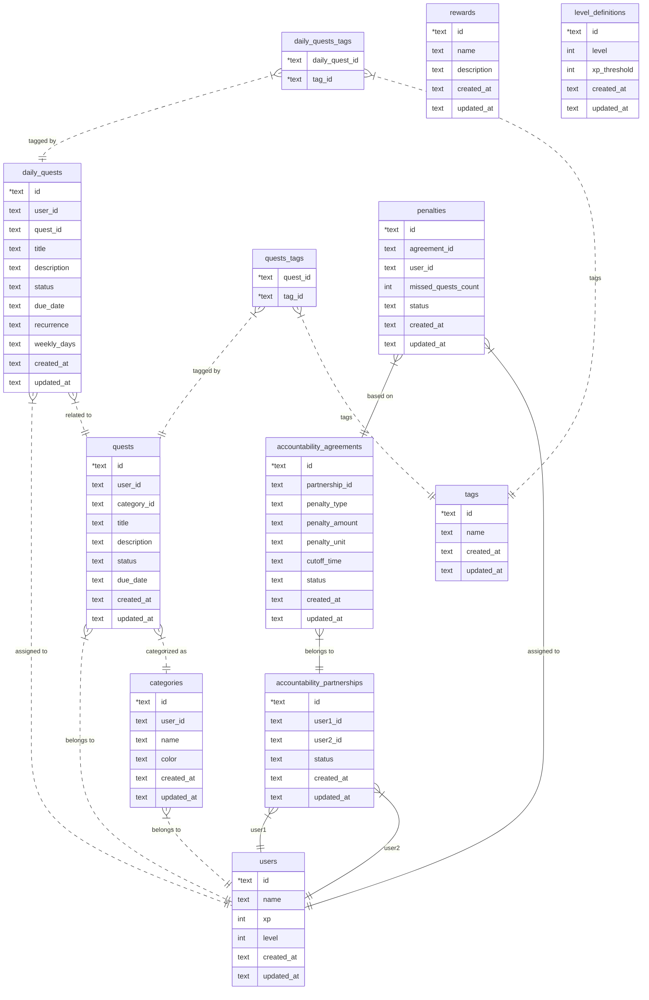

This is a simple app to help you manage your life quests.

## Database ERD

```mermaid
erDiagram
    users {
        *text id
        text name
        int xp
        int level
        text created_at
        text updated_at
    }

    categories {
        *text id
        text user_id
        text name
        text color
        text created_at
        text updated_at
    }

    daily_quests {
        *text id
        text user_id
        text quest_id
        text title
        text description
        text status
        text due_date
        text recurrence
        text weekly_days
        text created_at
        text updated_at
    }

    daily_quests_tags {
        *text daily_quest_id
        *text tag_id
    }

    quests {
        *text id
        text user_id
        text category_id
        text title
        text description
        text status
        text due_date
        text created_at
        text updated_at
    }

    quests_tags {
        *text quest_id
        *text tag_id
    }

    rewards {
        *text id
        text name
        text description
        text created_at
        text updated_at
    }

    tags {
        *text id
        text name
        text created_at
        text updated_at
    }

    level_definitions {
        *text id
        int level
        int xp_threshold
        text created_at
        text updated_at
    }

    accountability_partnerships {
        *text id
        text user1_id
        text user2_id
        text status
        text created_at
        text updated_at
    }

    accountability_agreements {
        *text id
        text partnership_id
        text penalty_type
        text penalty_amount
        text penalty_unit
        text cutoff_time
        text status
        text created_at
        text updated_at
    }

    penalties {
        *text id
        text agreement_id
        text user_id
        int missed_quests_count
        text status
        text created_at
        text updated_at
    }

    categories }|..|| users : "belongs to"
    quests }|..|| users : "belongs to"
    quests }|..|| categories : "categorized as"
    daily_quests }|..|| users : "assigned to"
    daily_quests }|..|| quests : "related to"
    daily_quests_tags }|..|| daily_quests : "tagged by"
    daily_quests_tags }|..|| tags : "tags"
    quests_tags }|..|| quests : "tagged by"
    quests_tags }|..|| tags : "tags"
    accountability_partnerships }|--|| users : "user1"
    accountability_partnerships }|--|| users : "user2"
    accountability_agreements }|--|| accountability_partnerships : "belongs to"
    penalties }|--|| accountability_agreements : "based on"
    penalties }|--|| users : "assigned to"
```
